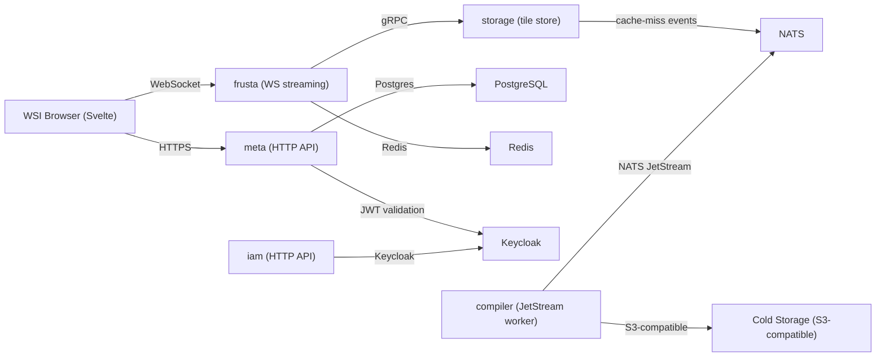

#  EOSIN

<p>
  <a href="https://app.eosin.ai/"></a>
  &nbsp;
  <a href="LICENSE-APACHE-2.0"></a>
  &nbsp;
  
  &nbsp;
  
</p>

Related blog posts:

- [Eosin I: Origins](https://thavlik.dev/blog/2026-02-20/eosin-i-origins)
- [Eosin II: Towards a Unified Standard](https://thavlik.dev/blog/2026-02-21/eosin-ii-towards-a-unified-standard)
- [Eosin III: Ecosystem Holes](https://thavlik.dev/blog/2026-02-22/eosin-iii-ecosystem-holes)
- [Cyto Vendor Examples](https://thavlik.dev/blog/2026-02-23/cyto-vendor-examples)

Eosin is an open-source, high-performance whole-slide imaging (WSI) platform built for the web.
It is the foundation of a broader computational pathology ecosystem: interactive viewing and annotation, cloud-native storage and serving, and real-time processing pipelines.

Demo available at https://app.eosin.ai/.

<p align="center">
  
</p>

The platform is built around a few non-negotiables:

- Rust services for correctness, throughput, and predictable latency
- Svelte frontends for a fast, web-native user experience
- Kubernetes-first deployment via Helm
- Event-driven pipelines (NATS JetStream) for real-time and batch workloads

This repository contains the "platform core": services, operator, and frontends required to run Eosin.

## High-level architecture

Conceptually:

- **Storage** holds multi-resolution slide tiles and supports sharding/replication.
- **Meta** stores the "database side" of WSI: slides, datasets, and annotations.
- **Frusta** provides a real-time WebSocket path optimized for interactive viewing.
- **IAM** provides user/auth-related endpoints and integrates with Keycloak.
- **Compiler / intake** provide ingestion and background processing (import, tiling, staging/GC).
- **Frontends** (browser + landing) are deployed as web apps and talk to these services.



## Feature highlights

Implemented in this codebase today:

- **Web-based WSI viewing path**: a dedicated WebSocket service (`frusta`) designed around viewport-driven, prioritized tile delivery.
- **Sharded tile storage backend** (`storage`): gRPC tile read/write APIs plus replication primitives.
- **Metadata + annotation service** (`meta`): slides, datasets, annotation sets, and geometry storage via an HTTP API.
- **Authentication integration**: services integrate with Keycloak (JWT validation, audience checks); `iam` provides user-facing endpoints (register/login/refresh/signout and user info lookup).
- **Event-driven processing**: NATS JetStream is used for durable messaging (e.g., compiler dispatch/processing, storage cache-miss events).
- **Kubernetes-native packaging**: Helm chart for deploying the core services and frontends.

Planned / in-progress features:

- Continued work on the storage operator and tile-serving workflows
- Real-time nuclei embedding (VAE-based) and ROI similarity search
- Continued expansion of viewer + annotation layers

## Philosophy and design goals

Many WSI stacks are still desktop-first, monolithic, and difficult to scale.
Eosin’s goal is a modern cloud-native platform for WSI storage, annotation, AI inference, teaching, and research.

Design goals:

- **Cloud-native by default**: a clear split between data plane (tiles) and control plane (metadata).
- **Horizontal scalability**: sharding, replication, and queue-based pipelines so throughput scales with hardware.
- **Composable components**: deploy services independently; integrate via explicit APIs.
- **Production-grade infrastructure**: health/ready endpoints, metrics hooks, explicit configuration, and Kubernetes-native packaging.
- **Web-native UX**: interactive viewing over WebSockets with service-side prioritization and rate limiting.

## Project status

Eosin is in **active development**.

- APIs and deployment defaults may change.
- Expect breaking changes while core components stabilize.

## Quickstart

Eosin is typically deployed to Kubernetes.
This Quickstart is intentionally minimal; for service-specific notes, see the READMEs within each component directory.

### Prerequisites

- A Kubernetes cluster and `kubectl`
- `helm`
- A container registry you can push to (or adjust chart values to pull from an existing registry)
- Dependencies reachable from the cluster:
  - Keycloak
  - NATS (JetStream enabled)
  - PostgreSQL
  - Redis
  - S3 or an S3-compatible object store

### Build images

This repo uses Docker Buildx Bake. The helper script pushes images by default and expects a Buildx builder named `bk`. You can create it with:

```bash
# If using a local registry, be sure to add it to this network.
# Otherwise you can skip this command.
docker network create buildnet 2>/dev/null || true

# Now create the builder
docker buildx create --name bk --driver docker-container --use \
  --config buildkitd.toml \
  --driver-opt network=buildnet # for optional local registry
```

Then build with:

```bash
./build.sh
```

If you need a registry prefix, set `REGISTRY` for bake (see [docker-bake.hcl](docker-bake.hcl)).

### Deploy to Kubernetes

1. Review chart defaults in [chart/values.yaml](chart/values.yaml).
2. Create the required Kubernetes secrets for Keycloak/NATS/Postgres/Redis/S3. Example manifests live under [secrets_example/](secrets_example/).
3. Install or upgrade the chart:

```bash
helm upgrade --install eosin ./chart \
  --namespace eosin \
  --create-namespace \
  -f myvalues.yaml
```

Or use the `./scripts/upgrade_eosin.sh` convenience script.

### Local development (selected pieces)

- Rust services:

```bash
cargo build --workspace
```

- Frontends:
  - Browser (WSI viewer): see [browser/README.md](browser/README.md)
  - Landing: see [landing/README.md](landing/README.md)

## Repository layout

- [browser/](browser/) — Svelte frontend for the WSI viewer
- [landing/](landing/) — Svelte landing web app
- [storage/](storage/) — tile storage backend (gRPC), sharding/replication primitives
- [storage-operator/](storage-operator/) — Kubernetes operator for storage lifecycle/topology
- [meta/](meta/) — metadata + annotations HTTP API (Postgres-backed)
- [frusta/](frusta/) — real-time WebSocket service for interactive viewport rendering
- [iam/](iam/) — identity/access endpoints; integrates with Keycloak
- [compiler/](compiler/) — ingestion/processing worker(s) backed by NATS JetStream and S3
- [intake/](intake/) — raw WSI intake path (S3 staging → storage), with optional garbage collection
- [chart/](chart/) — Helm chart for Kubernetes deployment
- [crds/](crds/) — Kubernetes CRDs used by operators
- [toy/](toy/) — A trivial WSI viewer written in Python for data validation purposes

## Contributing

Contributions are welcome.

- Use issues for bugs, design discussion, and feature proposals.
- Prefer small, focused PRs with clear rationale.
- Before opening a PR, run:

```bash
cargo fmt
cargo clippy --workspace --all-targets
```

Frontends live under [browser/](browser/) and [landing/](landing/) and use standard Node tooling.

## License

Licensed under either of:

- Apache License, Version 2.0 ([LICENSE-APACHE-2.0](LICENSE-APACHE-2.0))
- MIT license ([LICENSE-MIT](LICENSE-MIT))

at your option.
